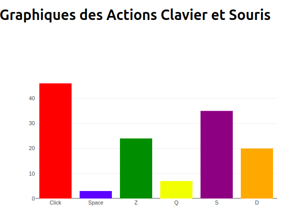

# 🏆 Check APM

## 🚀 Description  
**Check APM** est une application web développée avec **React Native** combiné à du **Python**. Son objectif est de surveiller vos **APM (Actions Par Minute)** pour évaluer vos performances en jeu — ou simplement vérifier si vous êtes un accro de la barre espace comme les 3/4 des joueurs gaming. 😎  

---

## 🎯 Fonctionnalités  
✅ **Analyse des APM**  
- Suivi en temps réel des touches suivantes :  
  - `Z`, `Q`, `S`, `D`  
  - **Barre espace**  
  - **Clic gauche**  

✅ **Adaptation aux jeux** *(à venir)*  
- L'application pourrait plus tard étendre le suivi à d'autres touches spécifiques en fonction du jeu utilisé.  

✅ **Stockage des données**  
- Les actions enregistrées seront stockées dans une **base de données**.  

✅ **Visualisation des données**  
- Les données seront affichées sous forme de **graphique en colonne** :  
  - Chaque colonne aura une **couleur différente** pour une meilleure lisibilité.  
  - Affichage du **type d'action** et du **nombre de fois** qu’elle a été effectuée.  

---

## 📊 Aperçu du fonctionnement  
  
*Exemple de graphique affichant les actions et leur fréquence d'utilisation*  

---

## 🛠️ Technologies utilisées  
- **React Native** – Interface utilisateur  
- **Python** – Gestion des données et logique backend  
- **SQLite** – Base de données  

---

## 🚧 Installation  
1. **Cloner le projet**  
```
git clone [https://github.com/votre-repo/check-apm.git](https://github.com/Altrevis/APM-application.git)
```

2. **Ajout des dépence si manquante**
```
npm install
```

3. **Lancer server.py et event_listener.py**
```
cd apm-app/python/
python3 server.py
```
```
cd apm-app/python/
python3 event_listener.py
```
